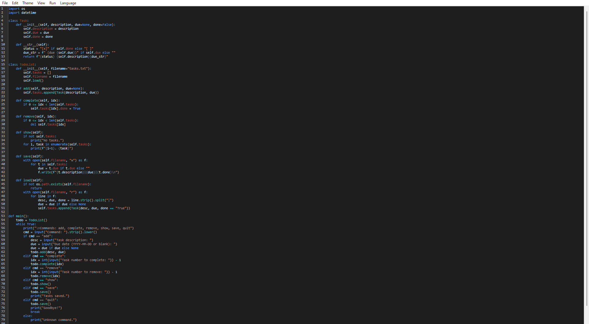
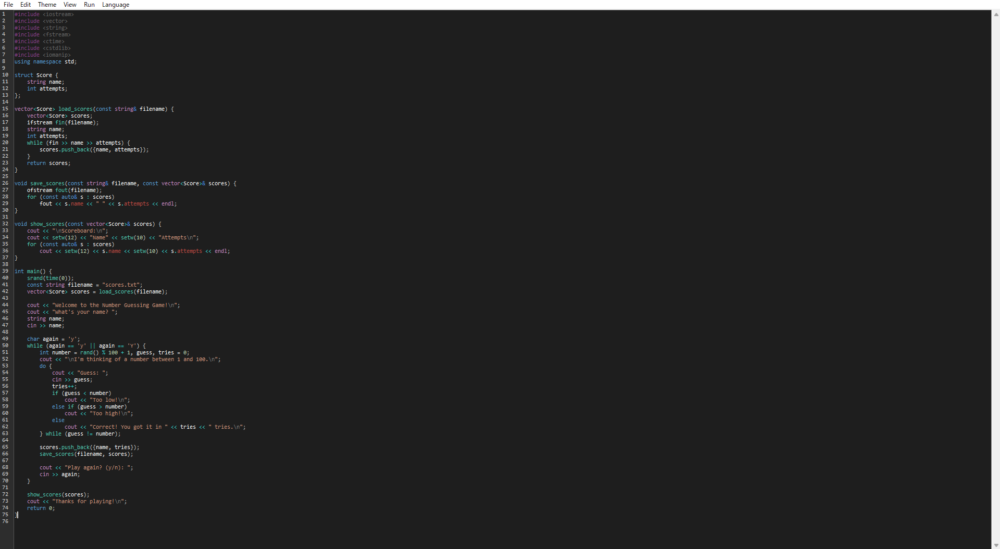
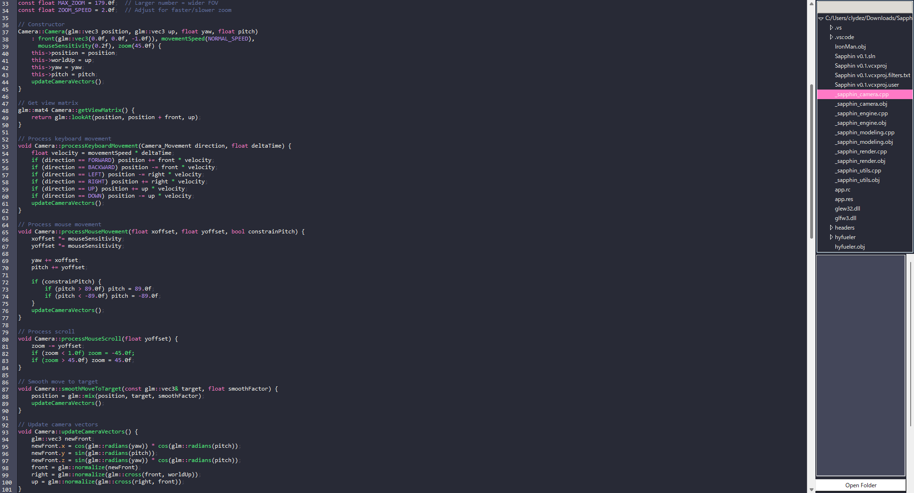
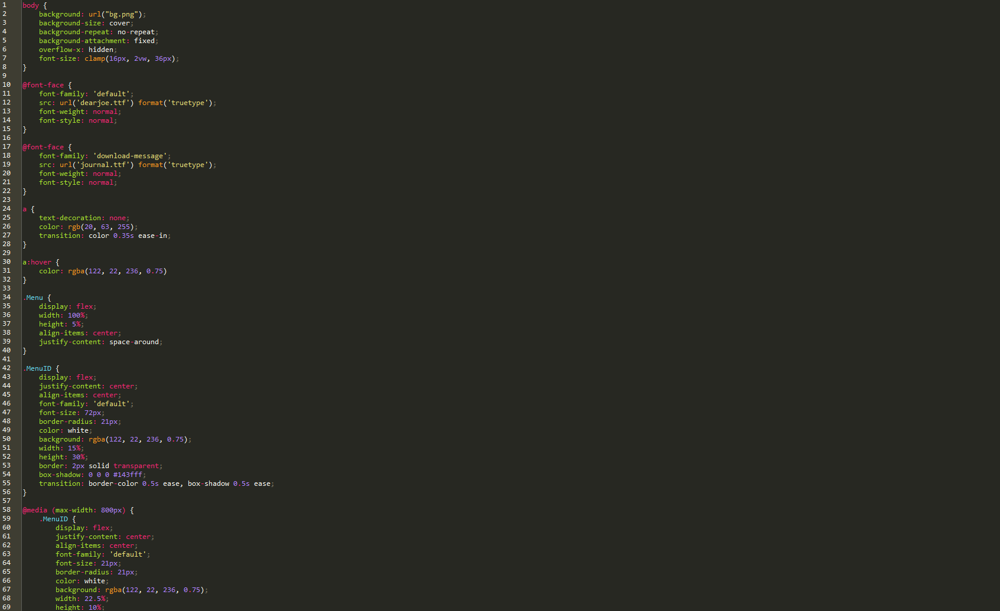

# The Slash Code Text Editor

* Hey, there! Have you ever wanted to check out smaller programs that aren't Visual Studio Code or Vim with several years of hard work, just something simple you can work with daily?
* Well, this is one of them.
# This text editor offers a small variety of languages to pick from (resulting in syntax highlighting for different keywords), fully functional syntax highlighting, session saving (if a previous session is present), the ability to run your files directly through the text editor, a sidebar with clear folder trees to help you navigate through directories easily (and access files inside of those directories), tooltips to help you understand what the specific keyword or function does, two different themes to choose from (6 different themes, also resulting in different syntax highlighting) and basic tools you can use, like finding a piece of text in a file or zooming in and out for whatever fits your eyes the best.
# Also, this text editor has translations for different languages to help you navigate the Slash Code UI better if English isn't your language of choice. More translations may be added as more updates published.
* While it may not seem much, it basically has what you physically need! It's a low-resource text editor that doesn't have features on every corner of your eyes. Nice on your eyes!
- Have fun!

