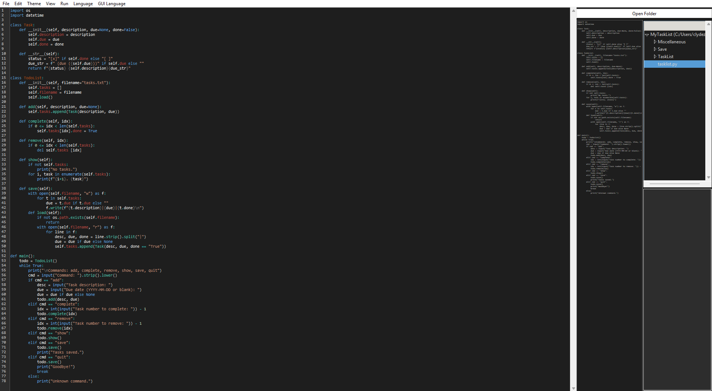
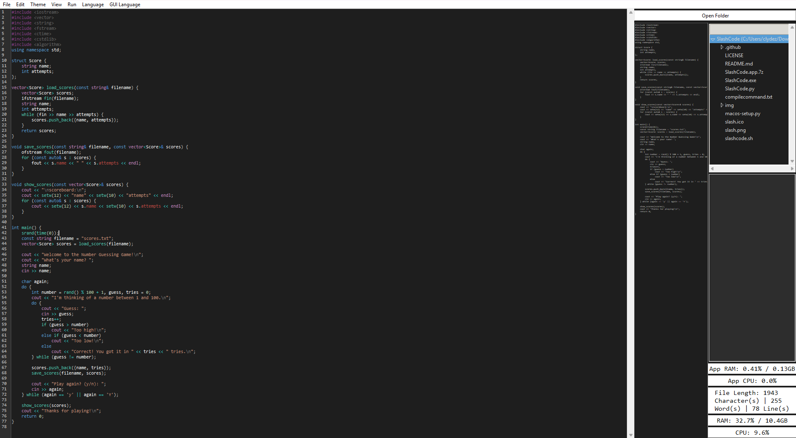
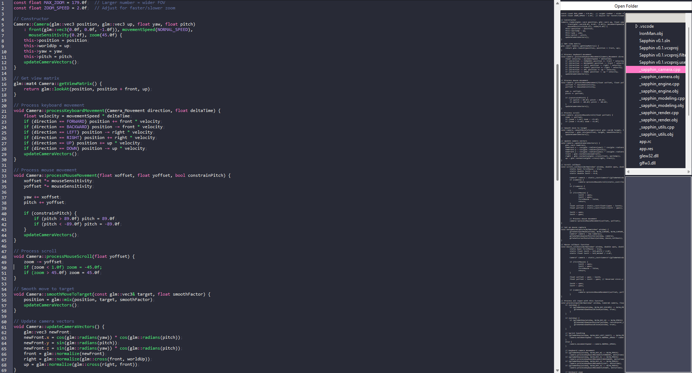
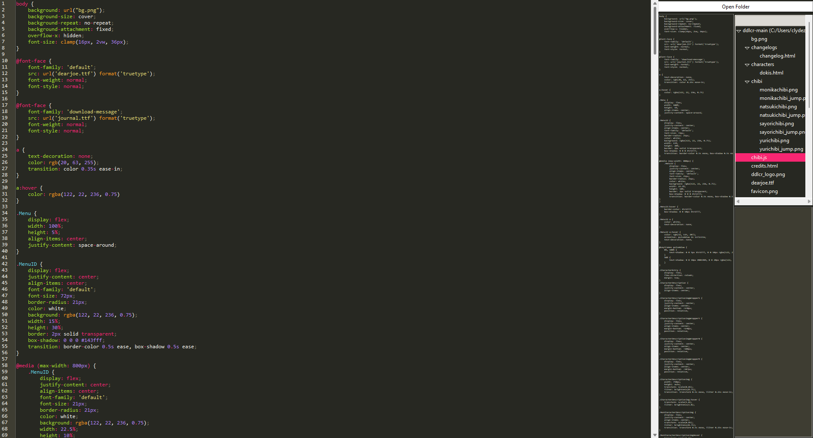
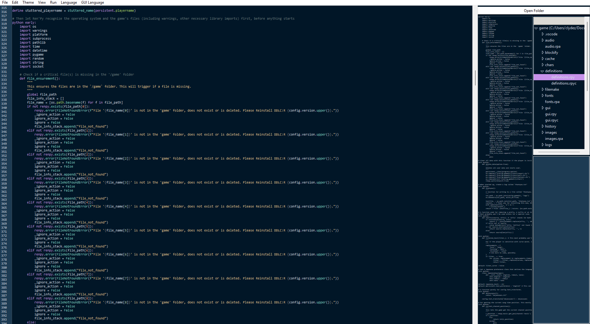
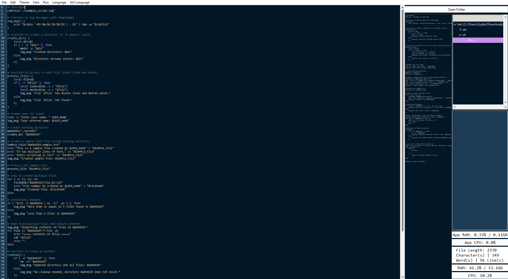

# Slash Code Text Editor

Hello there!  
Are you looking for a lightweight, straightforward code editor that's simpler than Visual Studio Code or Vim?  
**Slash Code** is a small, fast, multilingual text editor built for everyday coding — nothing heavy, just what you need.

---

## Features

### File & Project Management

- **Create new files** from scratch.
- **Open existing files** in many languages:
  - Python, JavaScript, HTML, CSS, C, C++, C/C++ headers, C#, Markdown, Ren'Py, Shell Scripts, and more.
- **Open folders** through the menu or sidebar and browse your project with a clear folder tree.
- **Save files** easily — whether new or existing.
- **Auto-save new unsaved files:**  
  If you forget to save new content before closing, Slash Code saves a temporary copy under `~/.slashcode/tempsave` and restores it on the next launch.
- **Clean temporary files and directories** via UI options, including cleanup of folders created during file execution.
- **Exit Slash Code** smoothly with session saving to resume where you left off.

### Editing Tools

- Undo/Redo support for recent text edits.
- Find & Replace functionality:
  - Search for text snippets.
  - Highlight all occurrences.
  - Replace one-by-one or all at once.

### Themes

Choose from **seven beautiful themes**, each providing unique syntax highlighting and UI styles:

| Theme             | Description                                                                |
|-------------------|----------------------------------------------------------------------------|
| Light             | Default; great for daylight and easy readability.                          |
| Dark              | Comfortable for long sessions; vivid and stylish.                          |
| Dracula           | Colorful, dark theme inspired by Dracula.                                  |
| Monokai           | Retro, vibrant, and easy on the eyes.                                      |
| Night Owl         | Designed for color-sensitive developers; deep and readable.                |
| Shades of Purple  | Playful, vibrant, and stylish.                                             |
| High Contrast     | Accessibility focused for users with poor visibility.                      |

### View Options

- Zoom in/out scales text, line numbers, and sidebar.
- Show/hide **sidebar** with your folder tree and minimap.
- Toggle **fullscreen mode** on/off for distraction-free coding.
- Show/hide debug info like CPU and RAM usage, character/word/line counts.

### Run Code

- Execute code files directly inside the editor.
- Shell script execution supported on Linux & macOS only.
- When running code, a temporary copy is created to protect your original files.
- Output window displays results or error logs with themed coloring.
- Save output conveniently to a `SC-Output` folder in your Downloads directory.
- Cleanup commands for temporary files and directories from runs.

### Supported Languages

- Plain Text
- Python
- JavaScript
- CSS
- HTML
- C++
- C#
- Markdown
- Ren'Py
- Shell Script

### GUI Language Support

Switch the interface and error messages into multiple languages — currently:

- English
- Dutch
- German
- Spanish
- Italian
- French
- Japanese
- Chinese
- Korean
- Arabic

More translations will be added with future updates!

---

## Recent Updates

> _This is the biggest update yet! Potentially the last one if no major bugs emerge — and I’m very proud of it._

1. Complete implementation of **full translations** for all UI strings and messages.
2. Improved `run_code()` and `install_runner()` for stable, clear code execution and logging.
3. Full command-line file loading with all supported file types.
4. Added optional **binary text viewer** for raw file reading (warning: might slow down editor).
5. Added 5 new GUI languages: German, Italian, Chinese, Korean, Arabic.
6. Sidebar UI revamped for better usability and integration.
7. Added **RiCM (Reboot in Console Mode)** for running Slash Code with an open console for debugging.
8. Added debug frames displaying real-time CPU/RAM usage and document stats updating every 2 seconds.
9. Output window colors sync dynamically with the current theme; includes save and exit buttons.
10. Added commands to wipe temporary directories created during code execution.
11. Fixed the replace functionality bug: now supports replacing individual occurrences as well as all at once.
12. Added **Shell Script** support with syntax highlighting and execution on Linux/macOS.
13. Added flag icons next to GUI language options for quicker identification.
14. Various bug fixes and performance improvements for a smoother experience.

---

## Why Slash Code?

It’s minimal but effective — no distractions, no overwhelming features, just the essentials done well.  
Runs lightweight on your system and gives you all the basic tools needed to code comfortably every day.

---

## Getting Started

- Download the latest release from GitHub.
- Unzip and run the executable (or launch `SlashCode.py` with Python 3.12 minimum, Python 3.13+ is recommended).
- Open files or folders and start coding!

---

## Contributions

Your feedback, bug reports, and contributions are very welcome!  
Feel free to open issues or pull requests for suggestions and fixes.

---

## License

**Slash Code has an official MIT-license that declares and acknowledges the acts of usage of the Slash Code text editor. Regarding the MIT-license, you're allowed to:**
    *Use Slash Code,*
    *Copy the Slash Code software,*
    *Merge the Slash Code software,*
    *Publish Slash Code,*
    *Distribute Slash Code software,*
    *Sublicense Slash Code,*
    *AND sell copies of Slash Code.*
This license is very permissive and allows you to do almost anything, but **put an eye on publishing and distributing Slash Code yourself —** You'll need to license the official MIT-license of Slash Code, otherwise, it might be possible for you to be subject to legal action.

The license is in the LICENSE file in the `main` tree. But, the MIT-license is also shared here:

MIT License

Copyright (c) 2025 clydezzz-sleepy

Permission is hereby granted, free of charge, to any person obtaining a copy
of this software and associated documentation files (the "Software"), to deal
in the Software without restriction, including without limitation the rights
to use, copy, modify, merge, publish, distribute, sublicense, and/or sell
copies of the Software, and to permit persons to whom the Software is
furnished to do so, subject to the following conditions:

The above copyright notice and this permission notice shall be included in all
copies or substantial portions of the Software.

THE SOFTWARE IS PROVIDED "AS IS", WITHOUT WARRANTY OF ANY KIND, EXPRESS OR
IMPLIED, INCLUDING BUT NOT LIMITED TO THE WARRANTIES OF MERCHANTABILITY,
FITNESS FOR A PARTICULAR PURPOSE AND NONINFRINGEMENT. IN NO EVENT SHALL THE
AUTHORS OR COPYRIGHT HOLDERS BE LIABLE FOR ANY CLAIM, DAMAGES OR OTHER
LIABILITY, WHETHER IN AN ACTION OF CONTRACT, TORT OR OTHERWISE, ARISING FROM,
OUT OF OR IN CONNECTION WITH THE SOFTWARE OR THE USE OR OTHER DEALINGS IN THE
SOFTWARE.

Make sure to follow the MIT-license's rules, even if there may be few, or there may be legal charges applied.

---

## Contact

For questions or support, please open an issue on GitHub or contact my email, `clydeisaspirit@gmail.com`.

